# 网络基础知识

本文档介绍使用 Xray 所需的基础网络知识，从计算机网络原理到代理技术，由浅入深帮助您理解 Xray 的工作原理。

## 目录

- [TCP/IP 协议栈](#tcpip-协议栈)
- [DNS 域名解析](#dns-域名解析)
- [代理技术原理](#代理技术原理)
- [TLS/SSL 加密](#tlsssl-加密)
- [HTTP 协议](#http-协议)
- [WebSocket 协议](#websocket-协议)

---

## TCP/IP 协议栈

TCP/IP 是互联网的基础协议族，采用分层架构设计。

### 四层模型

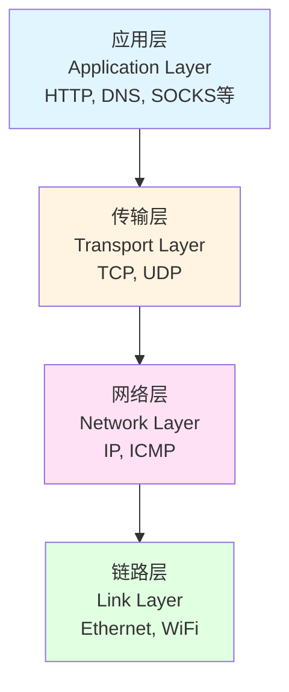

### TCP 三次握手

TCP 是面向连接的可靠传输协议，通过三次握手建立连接：

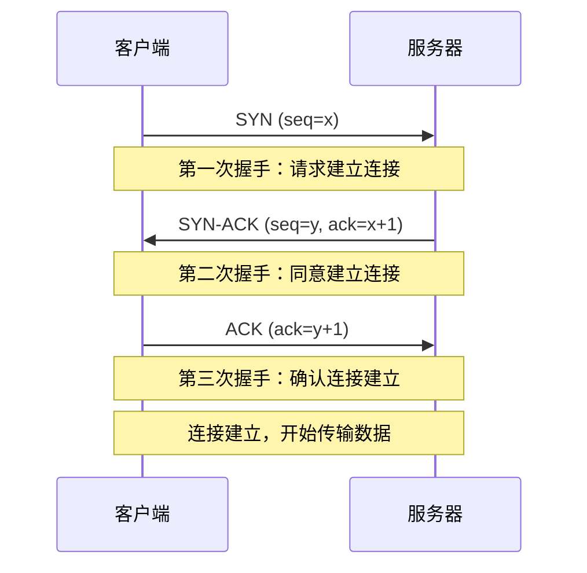

**为什么需要三次握手？**
- 防止旧的重复连接请求导致混乱
- 确保双方都具备发送和接收能力
- 同步双方的初始序列号

### UDP 协议

UDP 是无连接的传输协议，特点：
- **速度快**：无需建立连接，延迟低
- **不可靠**：不保证数据到达，不保证顺序
- **开销小**：没有拥塞控制和流量控制

**使用场景**：
- 视频/音频流（少量丢包可接受）
- DNS 查询（单次请求响应）
- 在线游戏（实时性优先）
- Xray 的 UDP 代理（如 QUIC）

---

## DNS 域名解析

DNS（Domain Name System）将人类可读的域名转换为 IP 地址。

### DNS 查询过程

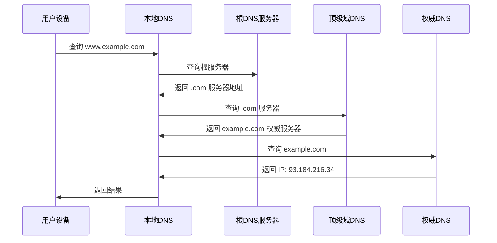

### DNS 污染与劫持

**DNS 污染**：
- 篡改 DNS 查询结果，返回错误的 IP 地址
- 导致无法访问特定网站

**Xray 的解决方案**：
1. **DNS over HTTPS (DoH)**：加密 DNS 查询
2. **DNS over TLS (DoT)**：TLS 加密通道
3. **分流 DNS**：国内外域名使用不同 DNS 服务器

---

## 代理技术原理

代理是介于客户端和目标服务器之间的中间服务器。

### 代理类型

#### 1. 正向代理（Forward Proxy）

客户端明确知道代理的存在，主动通过代理访问互联网。

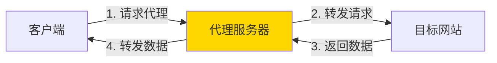

**特点**：
- 客户端配置代理地址
- 隐藏客户端真实 IP
- 可以突破网络限制
- **Xray 客户端就是正向代理**

#### 2. 反向代理（Reverse Proxy）

客户端不知道代理的存在，代理服务器代表后端服务器接收请求。

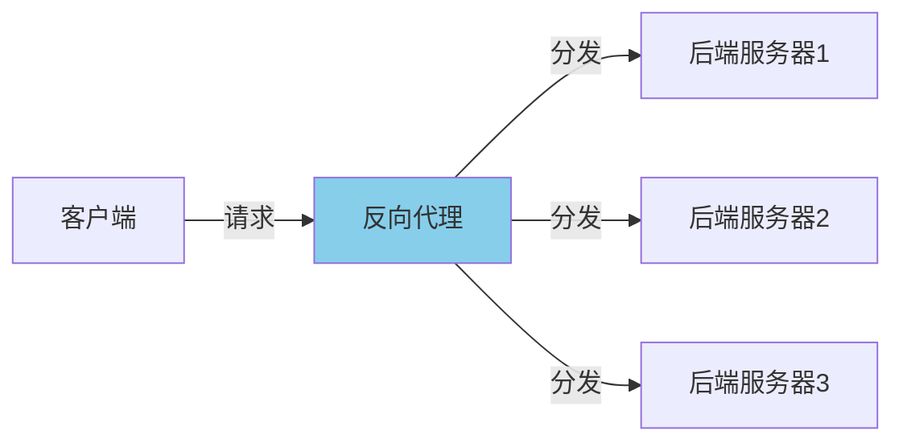

**特点**：
- 负载均衡
- 隐藏后端服务器
- SSL 卸载
- CDN 就是反向代理的应用

#### 3. 透明代理（Transparent Proxy）

客户端不知道代理的存在，网关自动转发流量到代理。

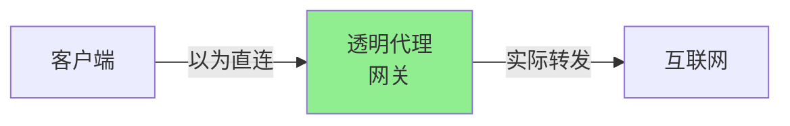

### 常见代理协议

#### SOCKS5

通用代理协议，支持 TCP 和 UDP：

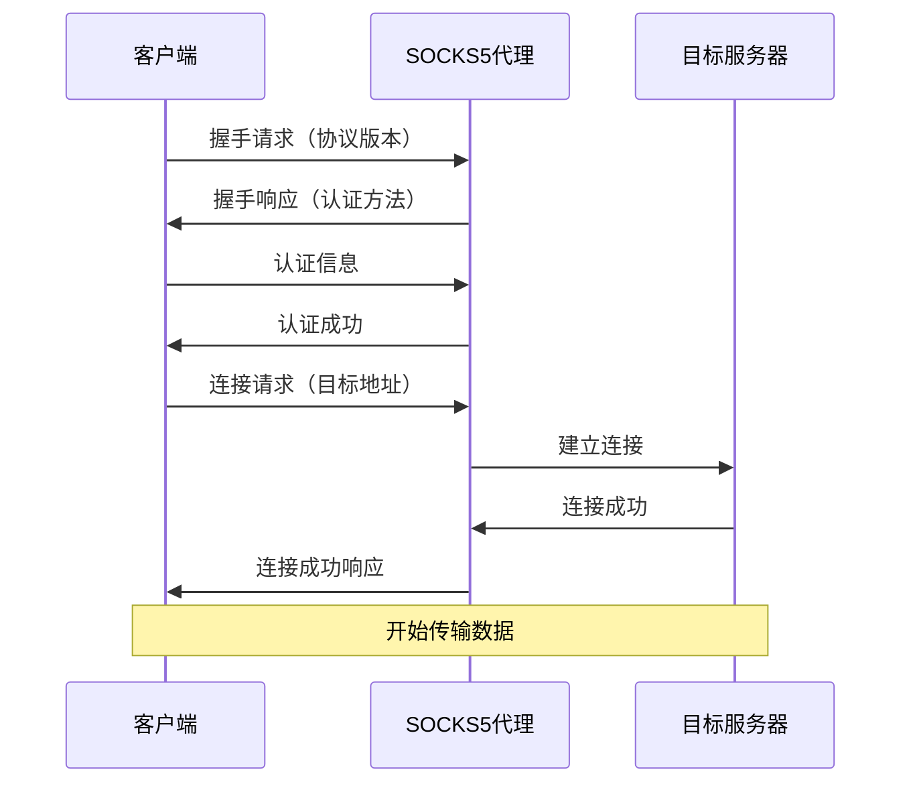

#### HTTP 代理

基于 HTTP CONNECT 方法的代理：

```
CONNECT example.com:443 HTTP/1.1
Host: example.com:443
Proxy-Authorization: Basic dXNlcjpwYXNz

HTTP/1.1 200 Connection Established
```

---

## TLS/SSL 加密

TLS（Transport Layer Security）是保障网络通信安全的加密协议。

### TLS 握手过程

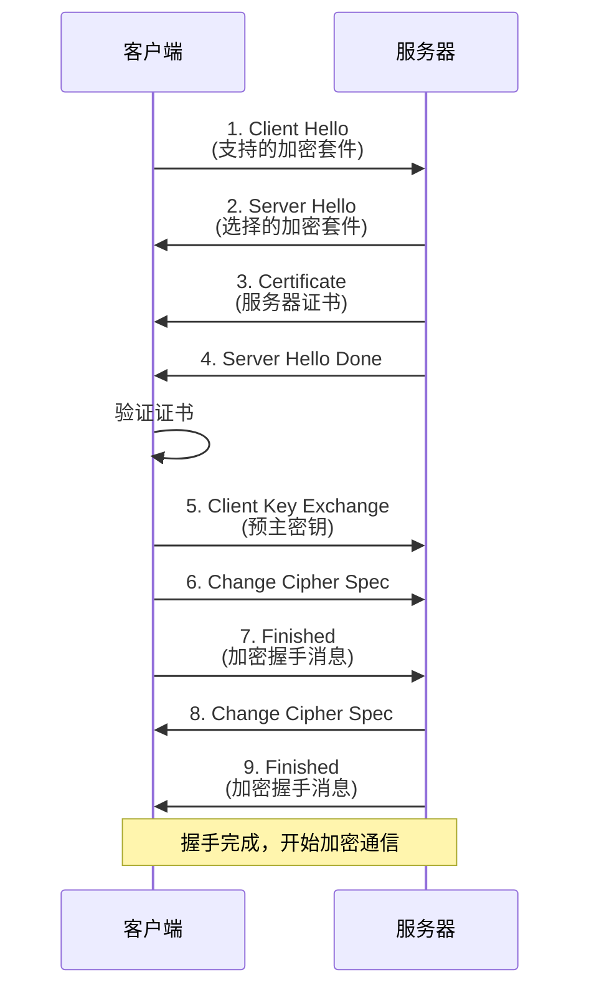

### 证书链验证

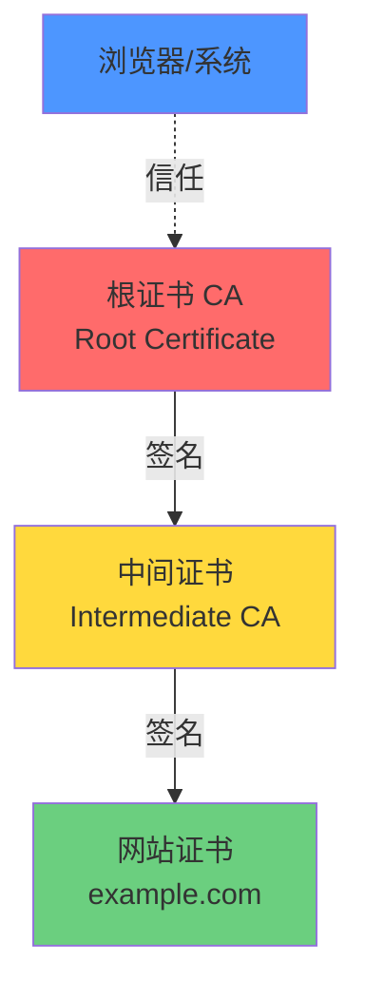

### SNI（Server Name Indication）

在 TLS 握手时指定要访问的域名：

```
ClientHello:
  - TLS Version: 1.3
  - Server Name: www.example.com  ← SNI
  - Cipher Suites: [...]
```

**问题**：SNI 是明文传输的，可能被审查。

**Xray 的解决方案**：
- **REALITY**：伪装 SNI，模拟访问其他网站
- **ECH (Encrypted Client Hello)**：加密 SNI

---

## HTTP 协议

HTTP（HyperText Transfer Protocol）是应用层协议。

### HTTP/1.1 vs HTTP/2 vs HTTP/3

| 特性 | HTTP/1.1 | HTTP/2 | HTTP/3 |
|------|----------|--------|--------|
| 传输层 | TCP | TCP | QUIC (UDP) |
| 多路复用 | ❌ | ✅ | ✅ |
| 头部压缩 | ❌ | ✅ (HPACK) | ✅ (QPACK) |
| 服务器推送 | ❌ | ✅ | ✅ |
| 队头阻塞 | ✅ 严重 | ⚠️ TCP层仍有 | ✅ 无 |

### HTTP/2 多路复用

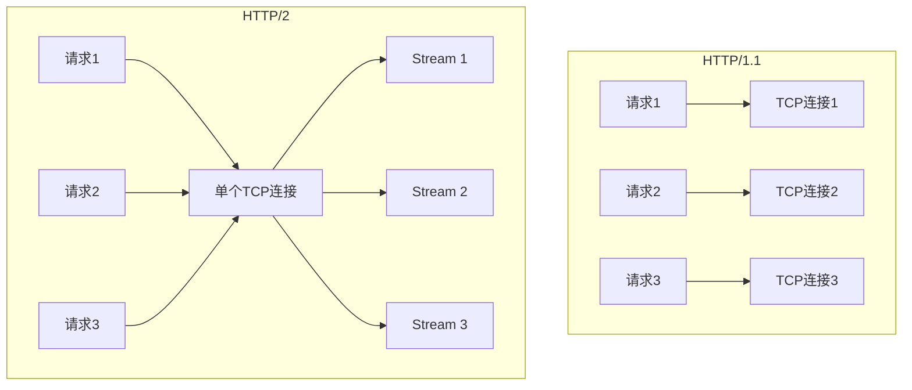

---

## WebSocket 协议

WebSocket 提供全双工通信通道，常用于 Xray 的传输层。

### WebSocket 握手

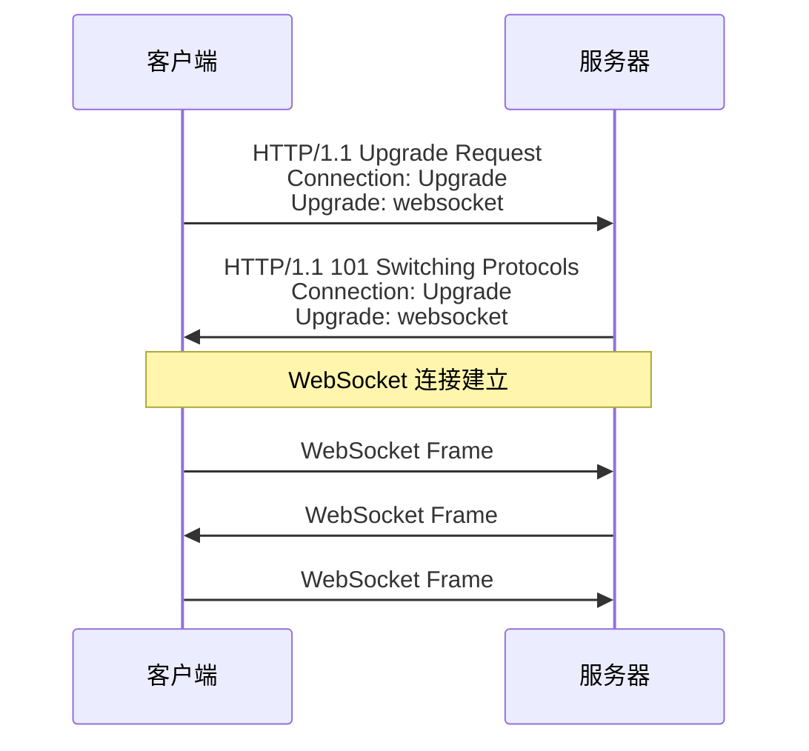

### 为什么 Xray 使用 WebSocket？

1. **伪装性好**：看起来像普通 HTTPS 流量
2. **穿透能力强**：CDN 通常支持 WebSocket
3. **兼容性好**：大多数防火墙允许通过
4. **全双工通信**：双向同时传输数据

### WebSocket vs 原始 TCP

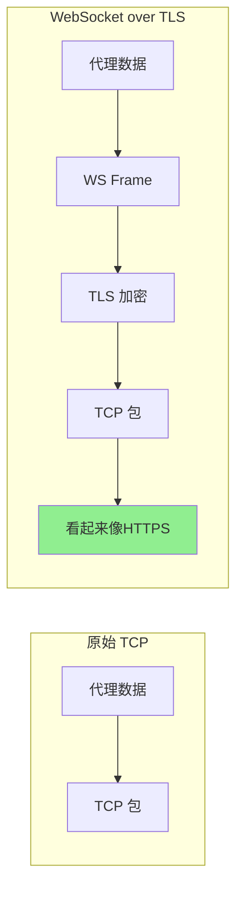

---

## 总结

### 数据包的旅程

一个完整的 Xray VLESS over WebSocket + TLS 连接的数据流：

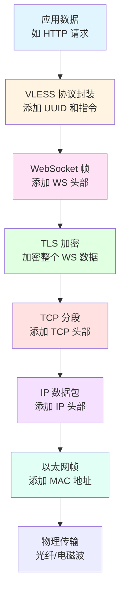

### 关键概念回顾

| 概念 | 作用 | Xray 中的应用 |
|------|------|---------------|
| TCP | 可靠传输 | 大多数传输方式的基础 |
| UDP | 快速传输 | QUIC、mKCP |
| DNS | 域名解析 | DoH/DoT 防污染 |
| TLS | 加密通信 | 保护隐私，防止审查 |
| WebSocket | 双向通信 | 伪装成普通 HTTPS |
| HTTP/2 | 多路复用 | gRPC 传输 |

---

## 下一步

- 📖 阅读 [Xray 架构详解](xray-architecture.md)
- 🔒 了解 [REALITY 协议原理](reality-guide.md)
- ⚡ 学习 [XTLS Vision 技术](xtls-vision-guide.md)
- 🛣️ 配置 [路由分流规则](routing-guide.md)
