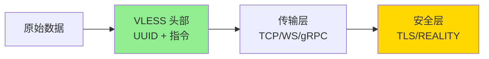
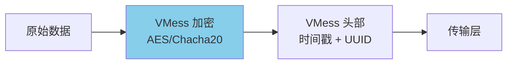
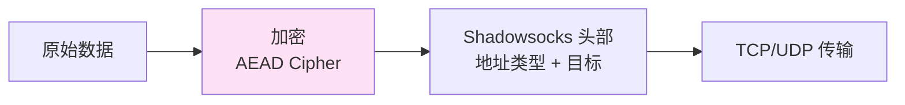
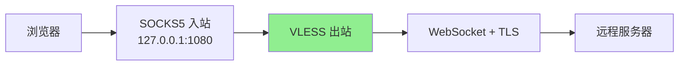
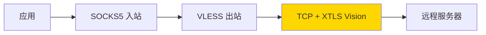
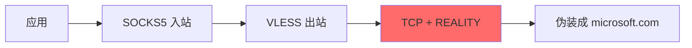
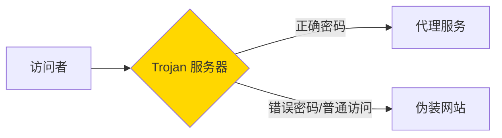
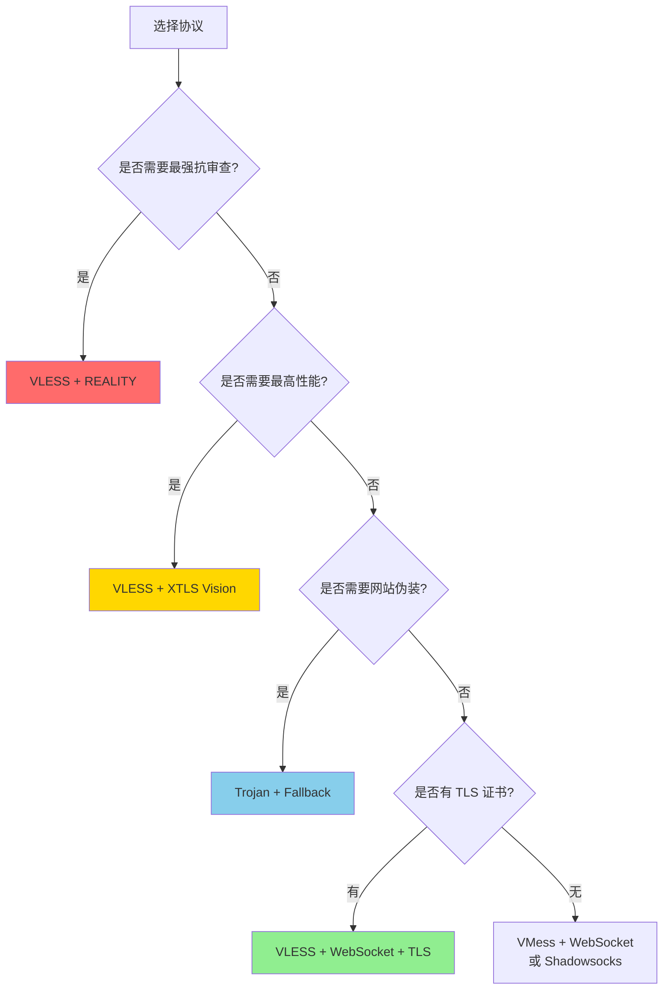

# Xray 协议对比

本文档对比 Xray 支持的各种代理协议，帮助您选择最适合的协议。

## 协议概览

### 协议对比表

| 协议 | 安全性 | 性能 | 伪装性 | 复杂度 | 推荐场景 |
|------|--------|------|--------|--------|----------|
| **VLESS** | ⭐⭐⭐⭐⭐ | ⭐⭐⭐⭐⭐ | ⭐⭐⭐⭐⭐ | ⭐⭐ | 🏆 首选，支持 XTLS 和 REALITY |
| **VMess** | ⭐⭐⭐⭐ | ⭐⭐⭐⭐ | ⭐⭐⭐⭐ | ⭐⭐⭐ | 成熟稳定，广泛支持 |
| **Trojan** | ⭐⭐⭐⭐ | ⭐⭐⭐⭐ | ⭐⭐⭐⭐⭐ | ⭐⭐ | TLS 伪装，适合审查严格地区 |
| **Shadowsocks** | ⭐⭐⭐ | ⭐⭐⭐⭐⭐ | ⭐⭐⭐ | ⭐ | 简单高效，轻量级 |
| **SOCKS5** | ⭐ | ⭐⭐⭐⭐⭐ | ⭐ | ⭐ | 本地代理，无加密 |
| **HTTP** | ⭐ | ⭐⭐⭐⭐ | ⭐⭐ | ⭐ | 本地代理，基础加密 |

---

## VLESS 协议

### 特点

VLESS 是 Xray 的旗舰协议，轻量且强大。



**核心优势**：
- ✅ 无状态协议，开销极小
- ✅ 支持 XTLS（性能提升 2-3 倍）
- ✅ 支持 REALITY（突破 TLS 审查）
- ✅ 原生 UDP 支持
- ✅ 可与任意传输层组合

**数据包格式**：
```
+------+-----+------+----------+
| Ver  | UUID| Cmd  | Payload  |
| 1B   | 16B | 1B   | Variable |
+------+-----+------+----------+
```

### 适用场景

- 🎯 **首选协议**：几乎所有场景
- 🚀 **高性能需求**：配合 XTLS Vision
- 🔒 **强审查地区**：配合 REALITY
- 🎮 **游戏/流媒体**：低延迟，UDP 支持

### 配置示例

参考配置：
- `examples/02-vless-tcp-basic-*.json` - 基础配置
- `examples/08-vless-reality-*.json` - REALITY 配置
- `examples/09-vless-xtls-vision-*.json` - XTLS Vision 配置

---

## VMess 协议

### 特点

VMess 是成熟的加密协议，历史悠久。



**核心优势**：
- ✅ 内置加密，无需 TLS
- ✅ 时间戳验证，防重放攻击
- ✅ 动态端口（alterID，已弃用）
- ✅ 广泛的客户端支持

**劣势**：
- ❌ 加密开销大于 VLESS+TLS
- ❌ 不支持 XTLS
- ❌ 协议特征明显（已有识别手段）

### 适用场景

- 📱 **兼容性优先**：老客户端支持
- 🔄 **无 TLS 环境**：自带加密
- 📊 **轻度使用**：个人日常浏览

### 配置示例

参考配置：
- `examples/03-vmess-tcp-basic-*.json` - 基础配置
- `examples/05-vmess-ws-tls-*.json` - WebSocket + TLS

---

## Trojan 协议

### 特点

Trojan 通过伪装成 HTTPS 流量来突破审查。

```mermaid
sequenceDiagram
    participant C as 客户端
    participant S as 服务器
    participant W as 伪装网站

    C->>S: TLS 握手（正常 HTTPS）
    S->>C: TLS 握手完成

    C->>S: Trojan 密码 + 目标地址
    S->>S: 验证密码

    alt 密码正确
        S->>C: 建立代理连接
    else 密码错误
        S->>W: 转发到伪装网站
        W->>C: 返回网站内容
    end

    style S fill:#ffd700
```

**核心优势**：
- ✅ 完美伪装成 HTTPS
- ✅ 密码验证简单高效
- ✅ Fallback 机制（密码错误显示网站）
- ✅ TLS 加密，安全可靠

**劣势**：
- ❌ 必须使用 TLS（需要证书）
- ❌ 密码泄露风险
- ❌ 不支持 XTLS

### 适用场景

- 🌐 **网站伪装**：假装是普通 HTTPS 网站
- 🔐 **简单部署**：密码认证，易于管理
- 🛡️ **中等审查地区**：TLS 流量不敏感

### 配置示例

参考配置：
- `examples/06-trojan-tls-*.json` - Trojan + TLS

---

## Shadowsocks 协议

### 特点

轻量级加密代理协议。



**核心优势**：
- ✅ 极其轻量，开销小
- ✅ 多种加密方式（AEAD）
- ✅ 简单易部署
- ✅ 生态成熟

**劣势**：
- ❌ 流量特征明显（已被识别）
- ❌ 抗审查能力弱
- ❌ 无身份验证（仅密码）

### 适用场景

- 🏠 **内网代理**：局域网加密通信
- 📡 **物联网**：嵌入式设备
- 🌍 **轻度审查地区**：网络环境宽松

---

## SOCKS5 & HTTP 协议

### SOCKS5

通用代理协议，无加密。

**特点**：
- ✅ 支持 TCP 和 UDP
- ✅ 开销极小，性能最高
- ❌ 无加密，仅用于本地

**使用场景**：
- 本地入站（`127.0.0.1:1080`）
- 局域网内代理
- 作为其他工具的上游

### HTTP 代理

基于 HTTP CONNECT 的代理。

**特点**：
- ✅ 兼容性好（浏览器原生支持）
- ✅ 简单易用
- ❌ 仅支持 TCP
- ❌ 无加密（需配合 TLS）

**使用场景**：
- 浏览器代理设置
- 企业内网代理
- 本地入站

---

## 协议组合推荐

### 场景 1：个人日常使用



**配置**：`examples/04-vless-ws-tls-*.json`

**优势**：稳定、伪装性好、CDN 友好

---

### 场景 2：高性能需求



**配置**：`examples/09-vless-xtls-vision-*.json`

**优势**：性能最优，延迟最低，适合游戏/流媒体

---

### 场景 3：强审查地区



**配置**：`examples/08-vless-reality-*.json`

**优势**：最强抗审查，无需真实 TLS 证书

---

### 场景 4：网站伪装



**配置**：`examples/06-trojan-tls-*.json`

**优势**：完美伪装，外部看起来是正常网站

---

## 协议选择决策树



---

## 性能对比

### 吞吐量测试

在相同网络条件下（1Gbps 带宽，10ms 延迟）：

| 协议 | 吞吐量 | CPU 使用率 |
|------|--------|-----------|
| VLESS + XTLS Vision | 950 Mbps | 15% |
| VLESS + TCP + TLS | 800 Mbps | 35% |
| VMess + TCP | 750 Mbps | 45% |
| Trojan + TLS | 800 Mbps | 35% |
| Shadowsocks (AEAD) | 820 Mbps | 30% |

### 延迟对比

| 协议 | 额外延迟 |
|------|---------|
| VLESS (无加密) | +1ms |
| VLESS + TLS | +5ms |
| VLESS + XTLS | +2ms |
| VMess | +8ms |
| Trojan | +5ms |

---

## 总结

### 推荐方案

| 优先级 | 方案 | 原因 |
|--------|------|------|
| 🥇 第一推荐 | **VLESS + REALITY** | 最强抗审查，无需证书 |
| 🥈 第二推荐 | **VLESS + XTLS Vision** | 最高性能，需要证书 |
| 🥉 第三推荐 | **VLESS + WS + TLS** | CDN 友好，稳定性好 |
| 💡 备选方案 | **Trojan + Fallback** | 网站伪装，简单高效 |

### 不推荐

- ❌ **裸 VMess**（无 TLS）：特征明显
- ❌ **Shadowsocks**（强审查地区）：已被识别
- ❌ **alterID ≠ 0**：已废弃，不安全

---

## 下一步

- 🔒 深入了解 [REALITY 协议](reality-guide.md)
- ⚡ 学习 [XTLS Vision 技术](xtls-vision-guide.md)
- 🚀 配置 [传输方式](transports-comparison.md)
- 🛣️ 设置 [路由规则](routing-guide.md)
