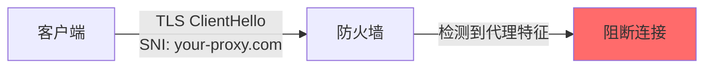
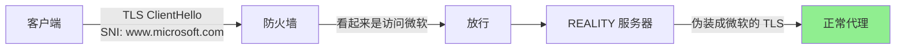
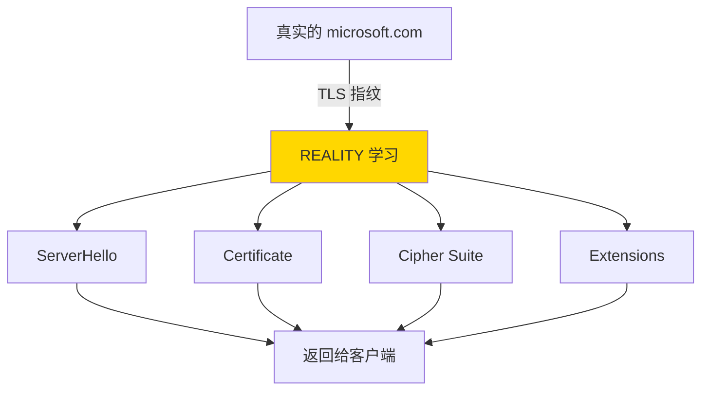
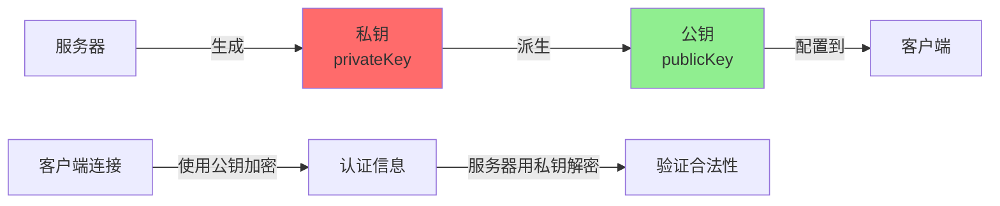
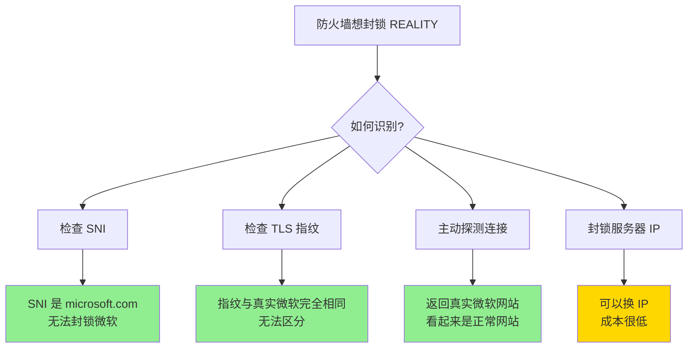
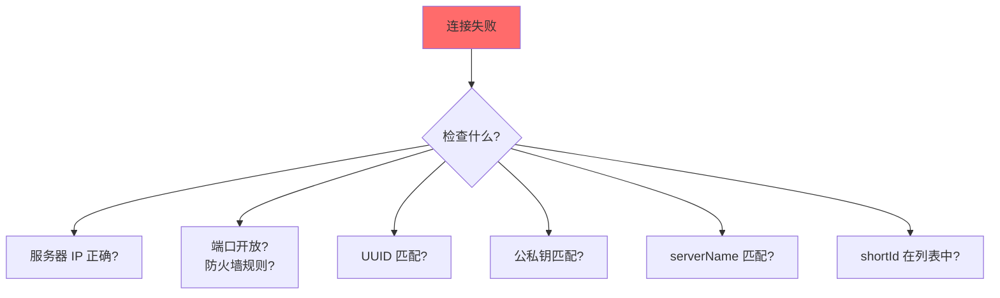
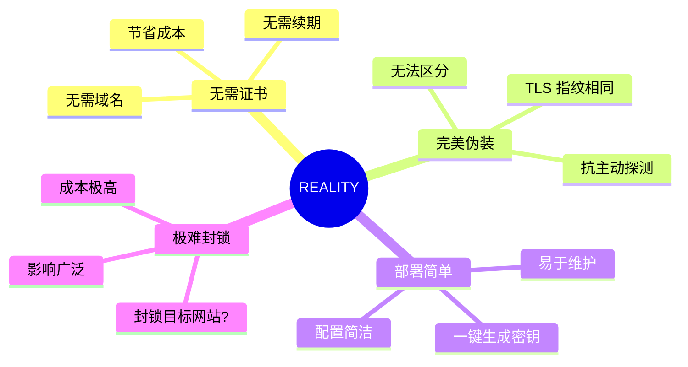

# REALITY 完整指南

REALITY 是 Xray 的革命性协议，通过"偷取"真实网站的 TLS 特征实现完美伪装，无需自己的 TLS 证书即可抵抗最严格的审查。

## 目录

- [什么是 REALITY](#什么是-reality)
- [工作原理](#工作原理)
- [核心优势](#核心优势)
- [部署指南](#部署指南)
- [高级配置](#高级配置)
- [故障排查](#故障排查)

---

## 什么是 REALITY

### 传统 TLS 代理的问题



**问题**：
1. ❌ 需要真实域名和 TLS 证书
2. ❌ SNI 明文传输，暴露目标
3. ❌ 证书可被枚举和封锁
4. ❌ TLS 指纹可被识别

### REALITY 的解决方案



**核心思想**：
- ✅ **窃取目标网站的 TLS**：伪装成访问 microsoft.com
- ✅ **无需自己的证书**：使用目标网站的证书特征
- ✅ **完美的 TLS 指纹**：与真实网站无法区分
- ✅ **抗主动探测**：非法连接会被转发到真实网站

---

## 工作原理

### REALITY 握手流程

```mermaid
sequenceDiagram
    participant C as 客户端
    participant R as REALITY 服务器
    participant M as 目标网站<br/>(microsoft.com)

    Note over C: 配置目标网站为<br/>microsoft.com

    C->>R: ClientHello<br/>SNI: www.microsoft.com<br/>+ REALITY 密钥认证

    R->>R: 验证 REALITY 密钥

    alt 密钥正确（合法客户端）
        R->>C: ServerHello<br/>伪装成 microsoft.com
        Note over C,R: 建立代理连接<br/>外部看起来是访问微软

    else 密钥错误（主动探测）
        R->>M: 转发连接
        M->>R: 真实的 microsoft.com 响应
        R->>C: 返回真实网站内容
        Note over C,R: 探测者看到真实的微软网站
    end

    style R fill:#ffd700
```

### 关键技术

#### 1. TLS 指纹窃取

REALITY 服务器模拟目标网站的 TLS 行为：



#### 2. 公私钥认证



#### 3. ShortId 机制

ShortId 是额外的认证标识，增加安全性：

```
服务器配置多个 shortId:
["", "0123456789abcdef", "0123456789", "01234567"]

客户端使用其中一个:
shortId: "0123456789abcdef"
```

---

## 核心优势

### 与其他方案对比

| 特性 | REALITY | VLESS+TLS | Trojan | VMess |
|------|---------|-----------|--------|-------|
| 需要证书 | ❌ | ✅ | ✅ | ❌ |
| TLS 指纹 | 🎭 伪装成目标站 | 📜 自己的证书 | 📜 自己的证书 | ❌ 无 TLS |
| 抗主动探测 | ✅ 完美 | ⚠️ 暴露服务器 | ⚠️ 暴露服务器 | ❌ 特征明显 |
| 证书过期 | ✅ 无影响 | ❌ 需续期 | ❌ 需续期 | - |
| 域名要求 | ❌ 不需要 | ✅ 需要 | ✅ 需要 | ❌ |
| 部署难度 | ⭐⭐ | ⭐⭐⭐ | ⭐⭐⭐ | ⭐ |

### 为什么 REALITY 几乎无法被封锁



---

## 部署指南

### 步骤 1：生成密钥对

在服务器上运行 Xray：

```bash
# 生成 x25519 密钥对
./xray x25519

# 输出示例：
# Private key: gK3C7v8Hs2AXxBk0qN4zMpL9RwYtUvJsOiDfEgQcFhI=
# Public key: ZN8fV2xYqL4wRkMtPsOeGhJiDc7bUnFaK9XvQmEyW1A=
```

**保存好这两个密钥！**

### 步骤 2：选择目标网站

选择一个大型、可信的 HTTPS 网站作为"伪装目标"。

**推荐网站**：
- `www.microsoft.com` - 微软（稳定性极高）
- `www.apple.com` - 苹果
- `www.amazon.com` - 亚马逊
- `www.cloudflare.com` - Cloudflare
- `gateway.icloud.com` - iCloud

**选择标准**：
1. ✅ 支持 TLS 1.3
2. ✅ 全球可访问
3. ✅ 不太可能被封锁
4. ✅ 稳定运行（大公司）

**验证目标网站**：
```bash
# 测试 TLS 连接
curl -I https://www.microsoft.com

# 检查 TLS 版本
openssl s_client -connect www.microsoft.com:443 -tls1_3
```

### 步骤 3：配置服务器

创建 `/etc/xray/config.json`：

```json
{
  "log": {
    "loglevel": "warning"
  },
  "inbounds": [
    {
      "port": 443,
      "protocol": "vless",
      "settings": {
        "clients": [
          {
            "id": "你的-UUID-这里",
            "flow": "",
            "email": "user@example.com"
          }
        ],
        "decryption": "none"
      },
      "streamSettings": {
        "network": "tcp",
        "security": "reality",
        "realitySettings": {
          "show": false,
          "dest": "www.microsoft.com:443",
          "xver": 0,
          "serverNames": [
            "www.microsoft.com",
            "microsoft.com"
          ],
          "privateKey": "gK3C7v8Hs2AXxBk0qN4zMpL9RwYtUvJsOiDfEgQcFhI=",
          "shortIds": [
            "",
            "0123456789abcdef"
          ]
        }
      }
    }
  ],
  "outbounds": [
    {
      "protocol": "freedom"
    }
  ]
}
```

**关键参数说明**：

| 参数 | 说明 |
|------|------|
| `dest` | 目标网站地址和端口 |
| `serverNames` | 允许的 SNI 列表（必须与目标网站匹配） |
| `privateKey` | 刚才生成的私钥 |
| `shortIds` | 认证标识数组，`""` 表示允许空 shortId |
| `xver` | 是否发送 PROXY protocol（通常设为 0） |
| `show` | 是否显示调试信息 |

### 步骤 4：配置客户端

创建客户端配置：

```json
{
  "inbounds": [
    {
      "port": 1080,
      "protocol": "socks"
    }
  ],
  "outbounds": [
    {
      "protocol": "vless",
      "settings": {
        "vnext": [
          {
            "address": "你的服务器IP或域名",
            "port": 443,
            "users": [
              {
                "id": "你的-UUID-这里",
                "encryption": "none",
                "flow": ""
              }
            ]
          }
        ]
      },
      "streamSettings": {
        "network": "tcp",
        "security": "reality",
        "realitySettings": {
          "show": false,
          "fingerprint": "chrome",
          "serverName": "www.microsoft.com",
          "publicKey": "ZN8fV2xYqL4wRkMtPsOeGhJiDc7bUnFaK9XvQmEyW1A=",
          "shortId": "0123456789abcdef",
          "spiderX": ""
        }
      }
    }
  ]
}
```

**客户端参数说明**：

| 参数 | 说明 |
|------|------|
| `serverName` | SNI 域名，必须在服务器的 `serverNames` 列表中 |
| `publicKey` | 服务器的公钥 |
| `shortId` | 必须在服务器的 `shortIds` 列表中 |
| `fingerprint` | 浏览器指纹（chrome/firefox/safari/ios/edge） |
| `spiderX` | 爬虫初始路径（通常留空） |

### 步骤 5：启动服务

```bash
# 启动服务器
systemctl start xray
systemctl enable xray

# 检查状态
systemctl status xray

# 查看日志
journalctl -u xray -f
```

### 步骤 6：测试连接

```bash
# 客户端测试
curl -x socks5://127.0.0.1:1080 https://www.google.com

# 检查 IP
curl -x socks5://127.0.0.1:1080 https://api.ip.sb/ip
```

---

## 高级配置

### 1. 多用户配置

```json
{
  "clients": [
    {
      "id": "uuid-1",
      "email": "user1@example.com"
    },
    {
      "id": "uuid-2",
      "email": "user2@example.com"
    },
    {
      "id": "uuid-3",
      "email": "user3@example.com"
    }
  ]
}
```

### 2. 多 shortId 提高安全性

```json
{
  "shortIds": [
    "",                    // 允许空 (兼容性)
    "0123456789abcdef",   // 16 字符
    "0123456789abcd",     // 14 字符
    "0123456789ab",       // 12 字符
    "0123456789",         // 10 字符
    "01234567",           // 8 字符
    "012345"              // 6 字符
  ]
}
```

不同客户端使用不同的 shortId，增加识别难度。

### 3. 指纹伪装

客户端可以选择不同的浏览器指纹：

```json
{
  "fingerprint": "chrome"    // chrome, firefox, safari, ios, edge, random
}
```

这会影响 TLS ClientHello 的特征。

### 4. 结合 Fallback

```json
{
  "inbounds": [
    {
      "port": 443,
      "protocol": "vless",
      "settings": {
        "clients": [...],
        "decryption": "none",
        "fallbacks": [
          {
            "dest": 8080  // 非法连接转发到本地 Web 服务
          }
        ]
      },
      "streamSettings": {
        "security": "reality",
        "realitySettings": {...}
      }
    }
  ]
}
```

### 5. 流量分流

```json
{
  "routing": {
    "rules": [
      {
        "type": "field",
        "inboundTag": ["reality-in"],
        "outboundTag": "proxy"
      },
      {
        "type": "field",
        "ip": ["geoip:cn"],
        "outboundTag": "direct"
      }
    ]
  }
}
```

---

## 性能优化

### 1. 启用 BBR 拥塞控制

```bash
# Linux 服务器优化
echo "net.core.default_qdisc=fq" >> /etc/sysctl.conf
echo "net.ipv4.tcp_congestion_control=bbr" >> /etc/sysctl.conf
sysctl -p
```

### 2. 调整系统限制

```bash
# 增加文件描述符限制
ulimit -n 65535

# 永久生效
echo "* soft nofile 65535" >> /etc/security/limits.conf
echo "* hard nofile 65535" >> /etc/security/limits.conf
```

---

## 故障排查

### 问题 1：连接失败



**排查步骤**：
```bash
# 1. 测试端口开放
telnet 服务器IP 443

# 2. 检查防火墙
iptables -L -n | grep 443
firewall-cmd --list-all

# 3. 查看 Xray 日志
journalctl -u xray -n 50

# 4. 开启调试模式
# 服务器配置中设置：
"show": true,
"loglevel": "debug"
```

### 问题 2：速度慢

**可能原因**：
1. 服务器带宽不足
2. 路由不优化
3. 目标网站响应慢

**解决方案**：
```json
{
  "realitySettings": {
    "dest": "gateway.icloud.com:443"  // 尝试更换目标网站
  }
}
```

### 问题 3：间歇性断线

**检查**：
- 目标网站是否稳定（用 `ping` 测试）
- 服务器是否被 QoS 限速
- 是否有流量限制

---

## 安全建议

### 1. 定期更换密钥

```bash
# 每 3-6 个月重新生成密钥
./xray x25519

# 更新配置
# 新旧密钥同时有效一段时间，逐步迁移客户端
```

### 2. 限制并发连接

```json
{
  "policy": {
    "levels": {
      "0": {
        "connIdle": 300,
        "handshake": 4
      }
    }
  }
}
```

### 3. 使用多个 shortId

不要只使用空 shortId，配置多个增加安全性。

### 4. 监控日志

```bash
# 定期检查可疑连接
journalctl -u xray | grep "rejected"
```

---

## 常见问题

**Q: REALITY 需要域名吗？**
A: ❌ 不需要！只需要服务器 IP，这是 REALITY 的核心优势。

**Q: 可以使用任何网站作为目标吗？**
A: ⚠️ 理论上可以，但推荐使用大型、稳定的网站（如微软、苹果）。

**Q: 目标网站宕机会影响连接吗？**
A: ⚠️ 会！如果目标网站无法访问，REALITY 可能无法正常工作。建议选择可靠的目标。

**Q: REALITY 比 TLS 更快吗？**
A: 性能相近，但 REALITY 无需证书管理，运维更简单。

**Q: fingerprint 选什么？**
A: 推荐 `chrome`，使用最广泛的浏览器指纹。

---

## 总结

### REALITY 的革命性意义



### 推荐配置

| 场景 | 目标网站 | fingerprint |
|------|----------|-------------|
| 通用 | www.microsoft.com | chrome |
| 中国用户 | gateway.icloud.com | safari |
| 欧美用户 | www.amazon.com | chrome |

---

## 下一步

- ⚡ 学习 [XTLS Vision 技术](xtls-vision-guide.md)
- 🛣️ 配置 [路由分流](routing-guide.md)
- 📚 查看 [配置示例](../examples/08-vless-reality-server.json)
- 🌐 了解 [使用场景](use-cases.md)

**参考配置文件**：
- `examples/08-vless-reality-server.json`
- `examples/08-vless-reality-client.json`
