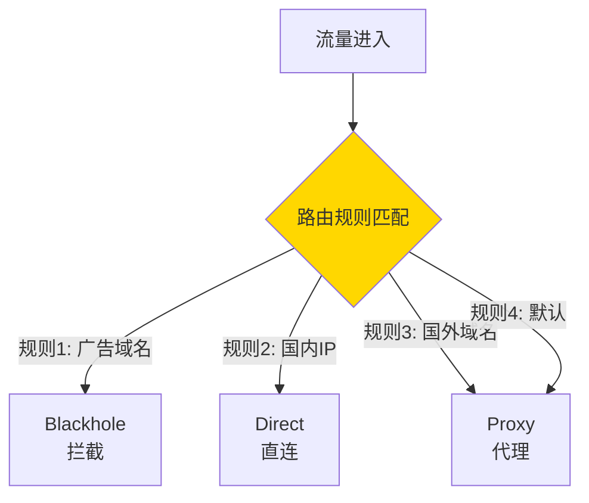

# Xray 路由配置指南

Xray 的路由系统是其核心功能之一，可以根据规则灵活分流流量，实现国内直连、国外代理、广告拦截等功能。

## 基础概念

### 路由工作流程



### 核心组件

- **入站标签（inboundTag）**：标识流量来源
- **出站标签（outboundTag）**：指定流量出口
- **路由规则（rules）**：匹配条件和动作
- **域名策略（domainStrategy）**：DNS 解析策略

---

## 域名策略

### domainStrategy 选项

| 策略 | 行为 | 适用场景 |
|------|------|----------|
| **AsIs** | 不解析域名，直接转发 | 服务器端，减少 DNS 查询 |
| **IPIfNonMatch** | 域名无法匹配时才解析 IP | 客户端推荐，性能最优 |
| **IPOnDemand** | 按需解析 IP | 需要 IP 规则时 |
| **UseIP** | 总是解析 IP | DNS 分流场景 |

### 推荐配置

**客户端**：
```json
{
  "routing": {
    "domainStrategy": "IPIfNonMatch",
    "rules": [...]
  }
}
```

**服务器**：
```json
{
  "routing": {
    "domainStrategy": "AsIs",
    "rules": [...]
  }
}
```

---

## 路由规则类型

### 1. 域名匹配

```json
{
  "type": "field",
  "domain": [
    "google.com",           // 完全匹配
    "domain:google.com",    // 域名及其子域名
    "full:google.com",      // 完全匹配（同第一种）
    "regexp:.*\\.google\\.com$",  // 正则表达式
    "geosite:google",       // 地理位置站点
    "geosite:cn"            // 中国网站
  ],
  "outboundTag": "proxy"
}
```

### 2. IP 匹配

```json
{
  "type": "field",
  "ip": [
    "192.168.0.0/16",      // CIDR
    "10.0.0.0/8",          // 私有地址
    "geoip:private",       // 地理位置（私有）
    "geoip:cn"             // 中国 IP
  ],
  "outboundTag": "direct"
}
```

### 3. 端口匹配

```json
{
  "type": "field",
  "port": "80,443,8080",
  "outboundTag": "proxy"
}
```

### 4. 网络类型

```json
{
  "type": "field",
  "network": "tcp,udp",
  "outboundTag": "proxy"
}
```

### 5. 协议匹配

```json
{
  "type": "field",
  "protocol": ["http", "tls", "bittorrent"],
  "outboundTag": "direct"
}
```

---

## 常见路由场景

### 场景 1：国内直连 + 国外代理

```json
{
  "routing": {
    "domainStrategy": "IPIfNonMatch",
    "rules": [
      {
        "type": "field",
        "domain": ["geosite:cn"],
        "outboundTag": "direct"
      },
      {
        "type": "field",
        "ip": ["geoip:cn", "geoip:private"],
        "outboundTag": "direct"
      },
      {
        "type": "field",
        "outboundTag": "proxy"
      }
    ]
  }
}
```

### 场景 2：广告拦截

```json
{
  "routing": {
    "rules": [
      {
        "type": "field",
        "domain": [
          "geosite:category-ads-all",
          "domain:doubleclick.net",
          "domain:googlesyndication.com"
        ],
        "outboundTag": "block"
      }
    ]
  }
}
```

### 场景 3：BT 直连

```json
{
  "routing": {
    "rules": [
      {
        "type": "field",
        "protocol": ["bittorrent"],
        "outboundTag": "direct"
      }
    ]
  }
}
```

### 场景 4：分流特定网站

```json
{
  "routing": {
    "rules": [
      {
        "type": "field",
        "domain": [
          "geosite:netflix",
          "geosite:disney",
          "geosite:hbo"
        ],
        "outboundTag": "streaming-proxy"
      },
      {
        "type": "field",
        "domain": ["geosite:openai"],
        "outboundTag": "chatgpt-proxy"
      }
    ]
  }
}
```

---

## 完整路由配置示例

```json
{
  "routing": {
    "domainStrategy": "IPIfNonMatch",
    "rules": [
      {
        "type": "field",
        "domain": ["geosite:category-ads-all"],
        "outboundTag": "block"
      },
      {
        "type": "field",
        "protocol": ["bittorrent"],
        "outboundTag": "direct"
      },
      {
        "type": "field",
        "ip": ["geoip:private"],
        "outboundTag": "direct"
      },
      {
        "type": "field",
        "domain": ["geosite:cn"],
        "outboundTag": "direct"
      },
      {
        "type": "field",
        "ip": ["geoip:cn"],
        "outboundTag": "direct"
      },
      {
        "type": "field",
        "domain": ["geosite:geolocation-!cn"],
        "outboundTag": "proxy"
      },
      {
        "type": "field",
        "outboundTag": "proxy"
      }
    ]
  }
}
```

---

## DNS 分流

### DNS 配置

```json
{
  "dns": {
    "servers": [
      {
        "address": "https://1.1.1.1/dns-query",
        "domains": ["geosite:geolocation-!cn"],
        "expectIPs": ["geoip:!cn"]
      },
      {
        "address": "https://223.5.5.5/dns-query",
        "domains": ["geosite:cn"],
        "expectIPs": ["geoip:cn"]
      },
      "localhost"
    ]
  }
}
```

参考配置：`examples/07-vless-routing-client.json`

---

## 负载均衡

### 配置负载均衡器

```json
{
  "routing": {
    "balancers": [
      {
        "tag": "balancer",
        "selector": ["proxy-1", "proxy-2", "proxy-3"],
        "strategy": {
          "type": "leastPing"
        }
      }
    ],
    "rules": [
      {
        "type": "field",
        "balancerTag": "balancer",
        "network": "tcp,udp"
      }
    ]
  },
  "observatory": {
    "subjectSelector": ["proxy-1", "proxy-2", "proxy-3"],
    "probeURL": "https://www.google.com/generate_204",
    "probeInterval": "1m"
  }
}
```

参考配置：`examples/14-multi-outbound-client.json`

---

## 最佳实践

### 1. 规则顺序

规则按顺序匹配，**第一个匹配的规则生效**。

**推荐顺序**：
1. 广告拦截
2. BT 等特殊协议
3. 私有地址
4. 国内域名和 IP
5. 国外域名
6. 默认规则

### 2. 性能优化

```json
{
  "routing": {
    "domainStrategy": "IPIfNonMatch",
    "rules": [
      // 域名规则在前（快速匹配）
      {"type": "field", "domain": ["geosite:cn"], "outboundTag": "direct"},
      // IP 规则在后（需要 DNS 解析）
      {"type": "field", "ip": ["geoip:cn"], "outboundTag": "direct"}
    ]
  }
}
```

### 3. 调试技巧

开启路由日志：
```json
{
  "log": {
    "loglevel": "debug"
  }
}
```

---

## 下一步

- 📚 查看 [使用场景示例](use-cases.md)
- 📖 阅读 [REALITY 指南](reality-guide.md)
- ⚡ 学习 [XTLS Vision](xtls-vision-guide.md)
