# Xray 使用场景指南

本文档介绍 Xray 在不同场景下的应用，从个人使用到企业部署，涵盖各种实际需求。

## 场景分类

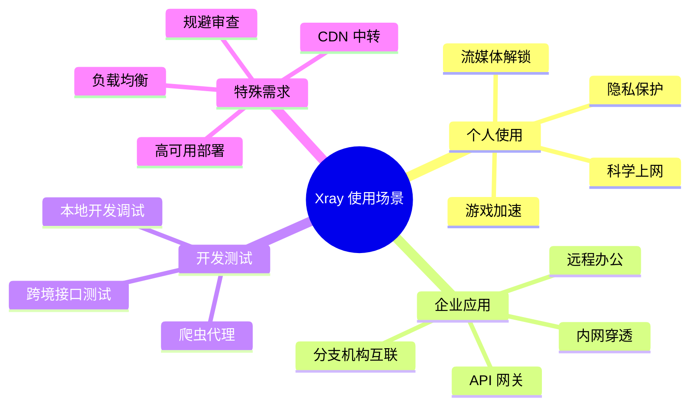

---

## 个人使用场景

### 1. 科学上网（翻墙）

**需求**：访问被屏蔽的国外网站（Google、Twitter、YouTube 等）

**推荐方案**：VLESS + REALITY

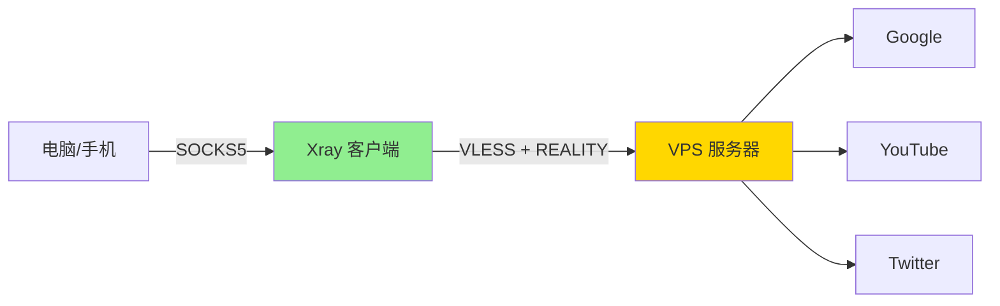

**配置文件**：
- 服务器：`examples/08-vless-reality-server.json`
- 客户端：`examples/08-vless-reality-client.json`

**优势**：
- ✅ 无需域名和证书
- ✅ 极难被检测和封锁
- ✅ 伪装成访问微软等大型网站

---

### 2. 流媒体解锁

**需求**：观看 Netflix、Disney+、HBO 等有地区限制的内容

**推荐方案**：VLESS + XTLS Vision（高带宽）

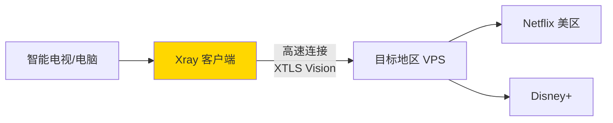

**配置文件**：
- 服务器：`examples/09-vless-xtls-vision-server.json`
- 客户端：`examples/09-vless-xtls-vision-client.json`

**路由规则**：
```json
{
  "routing": {
    "rules": [
      {
        "type": "field",
        "domain": ["geosite:netflix", "geosite:disney"],
        "outboundTag": "streaming-proxy"
      },
      {
        "type": "field",
        "domain": ["geosite:cn"],
        "outboundTag": "direct"
      }
    ]
  }
}
```

---

### 3. 游戏加速

**需求**：降低跨国游戏延迟（如美服、日服游戏）

**推荐方案**：VLESS + TCP（直连，低延迟）

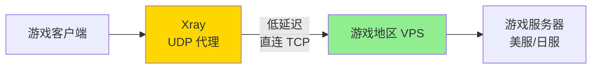

**优化配置**：
```json
{
  "inbounds": [{
    "protocol": "socks",
    "settings": {
      "udp": true  // 重要：启用 UDP
    }
  }],
  "outbounds": [{
    "protocol": "vless",
    "settings": {...},
    "streamSettings": {
      "network": "tcp",  // 不用 WebSocket，减少延迟
      "security": "tls",
      "tlsSettings": {
        "allowInsecure": false
      }
    }
  }]
}
```

**性能优化**：
- 选择物理距离近的 VPS
- 使用 XTLS Vision 减少加密开销
- 启用 UDP 支持
- 优先使用 TCP 传输（避免 WebSocket）

---

### 4. 隐私保护

**需求**：隐藏真实 IP，防止追踪

**推荐方案**：链式代理 + Tor

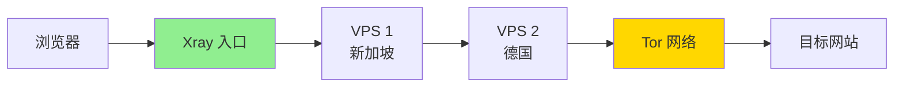

**配置文件**：`examples/15-chain-proxy-client.json`

---

## 企业应用场景

### 5. 内网穿透

**需求**：从外网访问家里/公司的内网服务（NAS、监控等）

**方案**：反向代理 + Dokodemo-door

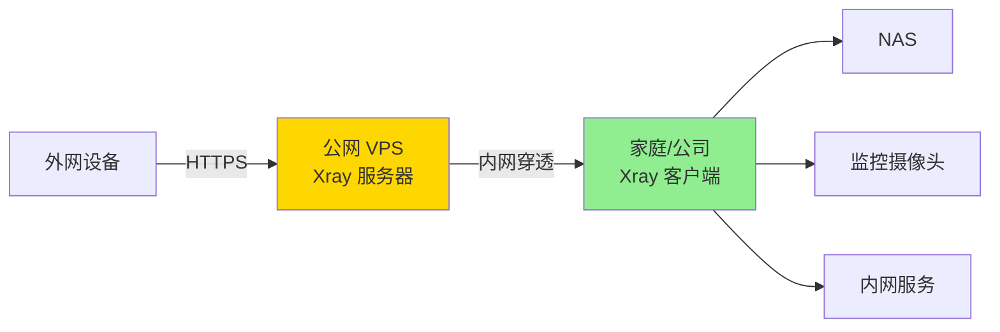

**配置示例**：

**VPS 服务器**（公网）：
```json
{
  "inbounds": [{
    "port": 443,
    "protocol": "vless",
    "settings": {
      "clients": [{"id": "uuid"}]
    }
  }]
}
```

**家庭客户端**（内网）：
```json
{
  "inbounds": [{
    "port": 12345,
    "protocol": "dokodemo-door",
    "settings": {
      "address": "192.168.1.100",  // NAS 地址
      "port": 80,
      "network": "tcp"
    }
  }],
  "outbounds": [{
    "protocol": "vless",
    "settings": {
      "vnext": [{
        "address": "VPS-IP",
        "port": 443,
        "users": [{"id": "uuid"}]
      }]
    }
  }]
}
```

---

### 6. 远程办公

**需求**：员工在家安全访问公司内网

**方案**：企业 VPN 替代方案

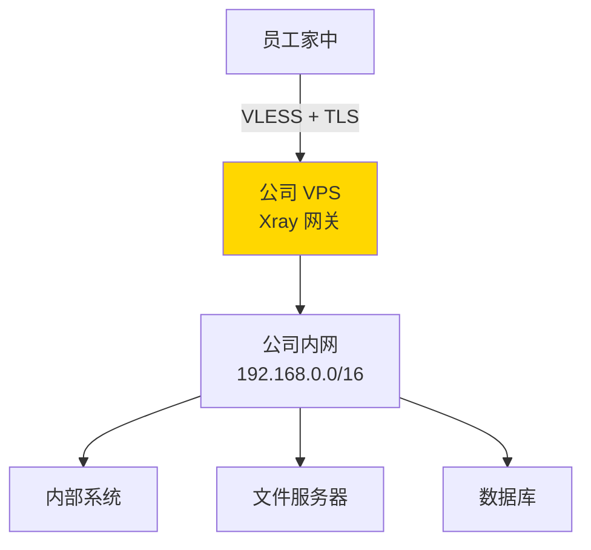

**优势**：
- ✅ 比传统 VPN 更轻量
- ✅ 更难被防火墙识别
- ✅ 支持多用户和权限管理

---

### 7. 分支机构互联

**需求**：总部与各地分公司网络互通

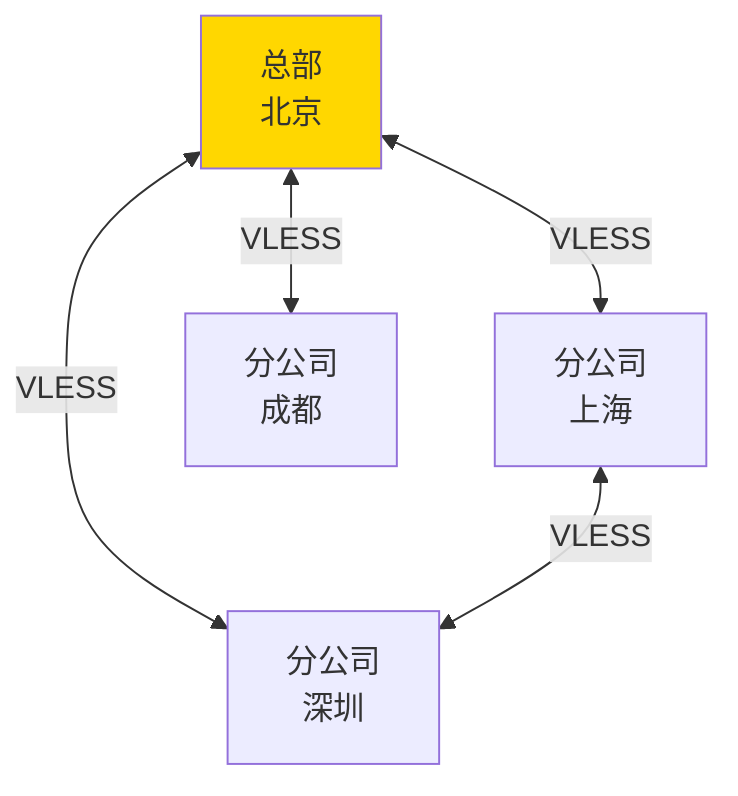

**配置**：每个节点同时作为服务器和客户端

---

## 开发测试场景

### 8. 本地开发调试

**需求**：本地开发调试国外 API

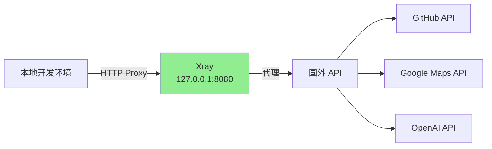

**配置**：
```json
{
  "inbounds": [{
    "port": 8080,
    "protocol": "http"  // HTTP 代理，方便开发
  }]
}
```

**使用**：
```bash
# 环境变量
export HTTP_PROXY=http://127.0.0.1:8080
export HTTPS_PROXY=http://127.0.0.1:8080

# 或直接指定
curl -x http://127.0.0.1:8080 https://api.github.com
```

---

### 9. 爬虫代理

**需求**：分布式爬虫，避免 IP 封禁

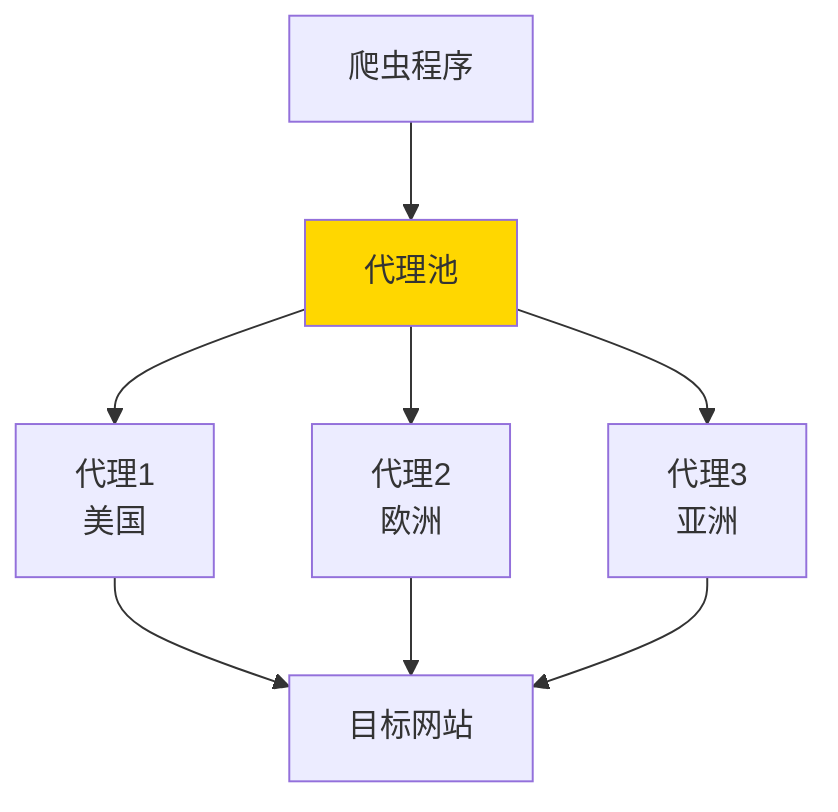

**配置**：使用负载均衡自动切换代理

参考：`examples/14-multi-outbound-client.json`

---

## 特殊场景

### 10. CDN 中转

**需求**：利用 CDN 隐藏服务器真实 IP

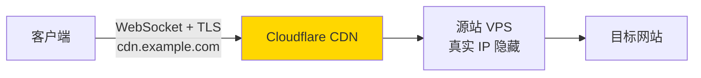

**要求**：
- 必须使用 WebSocket 或 gRPC（CDN 支持）
- 必须使用 TLS
- 域名托管在支持 WebSocket 的 CDN

**配置文件**：
- `examples/04-vless-ws-tls-server.json`
- `examples/10-vless-grpc-tls-server.json`

---

### 11. 高可用部署

**需求**：防止单点故障，自动故障转移

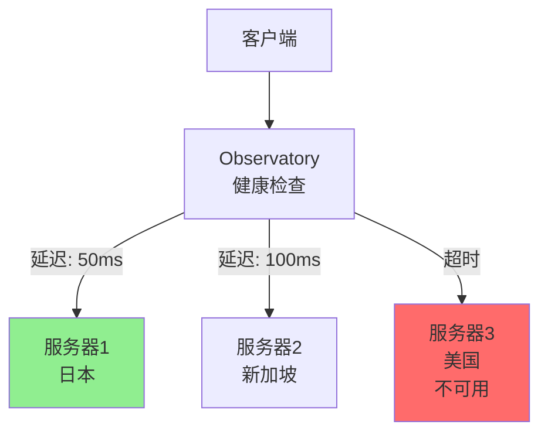

**配置**：
```json
{
  "routing": {
    "balancers": [{
      "tag": "balancer",
      "selector": ["jp-server", "sg-server", "us-server"],
      "strategy": {"type": "leastPing"}
    }]
  },
  "observatory": {
    "subjectSelector": ["jp-server", "sg-server", "us-server"],
    "probeURL": "https://www.google.com/generate_204",
    "probeInterval": "1m"
  }
}
```

参考：`examples/14-multi-outbound-client.json`

---

### 12. 规避深度包检测（DPI）

**需求**：突破最严格的网络审查

**方案对比**：

| 场景 | 推荐方案 | 原因 |
|------|---------|------|
| 轻度审查 | WebSocket + TLS | 简单有效 |
| 中度审查 | XTLS Vision | 性能好，特征少 |
| 重度审查 | REALITY | 几乎无法检测 |
| 极端审查 | REALITY + CDN 中转 | 多重伪装 |

---

## 场景选择矩阵

| 需求 | 推荐协议 | 推荐传输 | 配置难度 |
|------|---------|---------|---------|
| 科学上网 | VLESS | REALITY | ⭐⭐ |
| 流媒体 | VLESS | XTLS Vision | ⭐⭐⭐ |
| 游戏加速 | VLESS | TCP (直连) | ⭐⭐ |
| CDN 中转 | VLESS/VMess | WebSocket + TLS | ⭐⭐⭐ |
| 内网穿透 | VLESS | TCP + TLS | ⭐⭐⭐ |
| 企业互联 | VLESS | gRPC + TLS | ⭐⭐⭐⭐ |
| 开发调试 | SOCKS/HTTP | 本地 | ⭐ |

---

## 性能对比

### 不同场景的性能需求

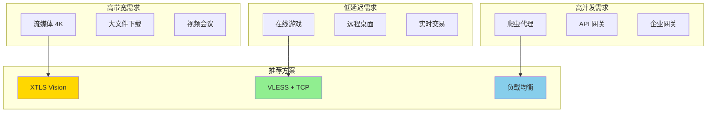

---

## 安全建议

### 各场景的安全要点

| 场景 | 安全建议 |
|------|---------|
| 个人使用 | 定期更换密钥，不共享配置 |
| 企业部署 | 启用多用户认证，记录日志 |
| 公共代理 | 严格限制流量，防止滥用 |
| 敏感通信 | 使用链式代理，启用日志混淆 |

---

## 总结

选择合适的方案：

1. **优先考虑需求**：性能、安全、成本
2. **评估风险**：网络环境、审查程度
3. **选择协议**：REALITY（抗审查）或 XTLS Vision（性能）
4. **配置传输**：WebSocket（CDN）或 TCP（直连）
5. **测试优化**：实际测试，持续调优

---

## 下一步

- 📖 查看 [配置文件索引](../examples/README.md)
- 🔒 深入 [REALITY 指南](reality-guide.md)
- ⚡ 学习 [XTLS Vision](xtls-vision-guide.md)
- 🛣️ 配置 [路由规则](routing-guide.md)
