# Xray 架构详解

本文档深入介绍 Xray-core 的架构设计、核心组件和工作原理。

## 目录

- [架构概览](#架构概览)
- [核心组件](#核心组件)
- [数据流处理](#数据流处理)
- [配置结构](#配置结构)

---

## 架构概览

### 整体架构图

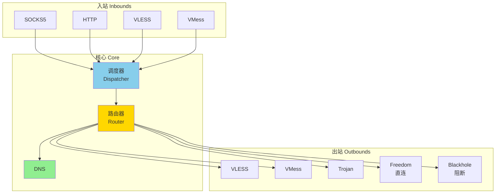

### 设计理念

Xray 采用**模块化设计**，核心特点：

1. **入站协议独立**：支持多种入站协议同时运行
2. **出站协议独立**：每个出站可使用不同协议和配置
3. **路由系统**：基于规则的灵活流量分发
4. **传输层分离**：协议层和传输层解耦

---

## 核心组件

### 1. 入站处理（Inbound）

入站负责接收客户端连接，解析协议并提取目标信息。

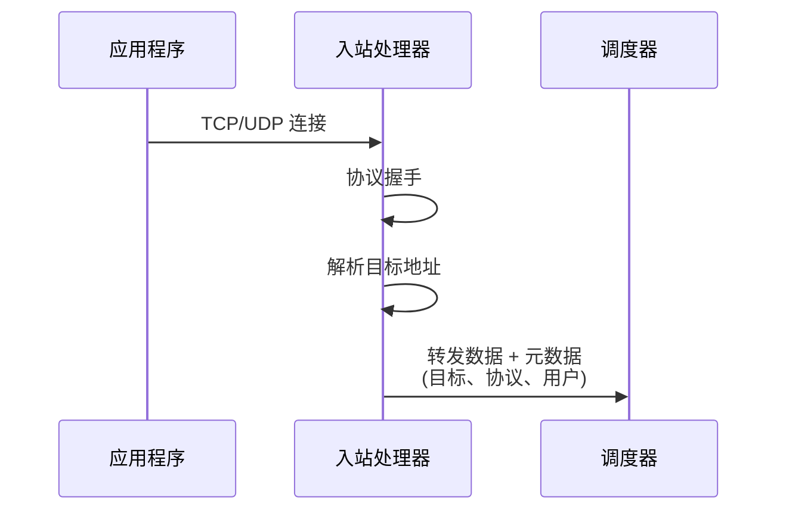

**支持的入站协议**：
- **SOCKS**：SOCKS5 代理协议
- **HTTP**：HTTP/HTTPS 代理
- **VLESS**：轻量级协议
- **VMess**：加密传输协议
- **Trojan**：伪装协议
- **Dokodemo-door**：透明代理
- **Shadowsocks**：Shadowsocks 协议

### 2. 路由器（Router）

路由器根据规则决定数据流向哪个出站。

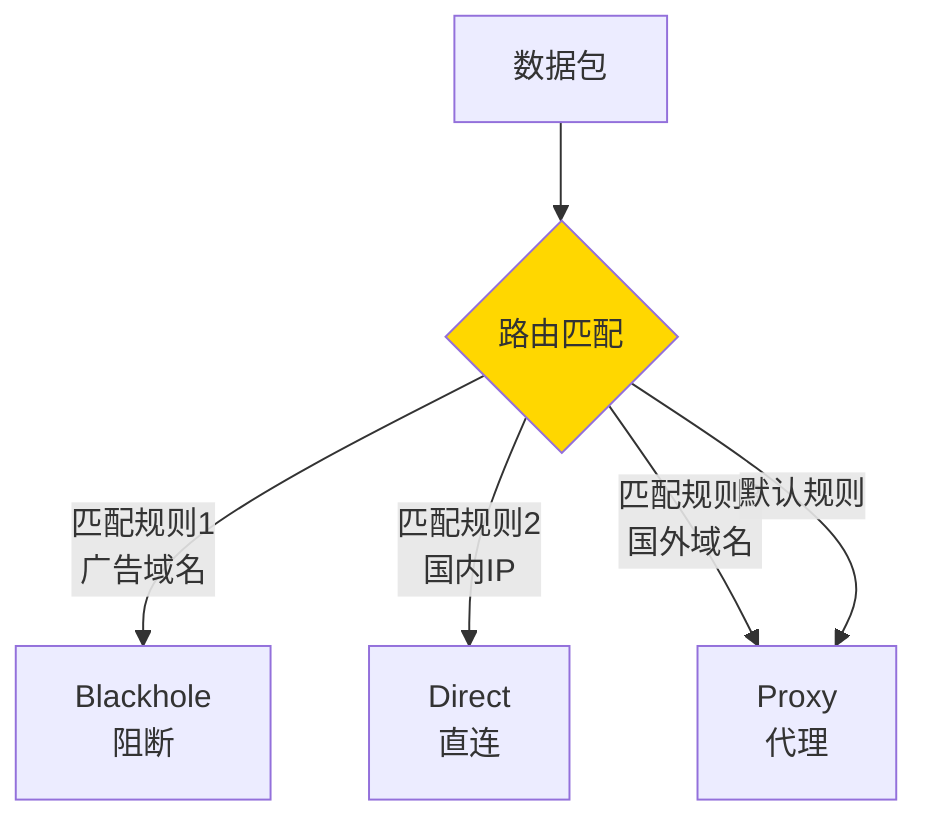

**路由规则类型**：
- **域名匹配**：domain、geosite
- **IP 匹配**：ip、geoip
- **端口匹配**：port、portRange
- **协议匹配**：protocol (如 bittorrent)
- **网络类型**：network (tcp/udp)
- **入站标签**：inboundTag
- **用户邮箱**：user

### 3. 调度器（Dispatcher）

调度器协调入站和出站，处理数据转发。

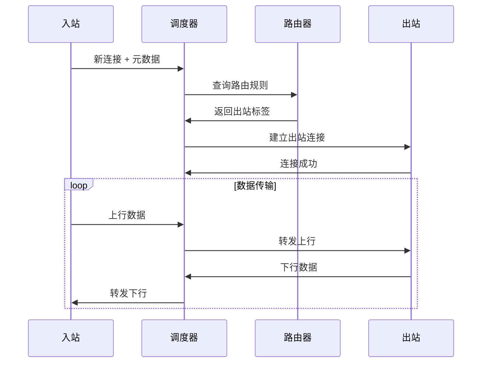

### 4. DNS 解析器

内置 DNS 解析器，支持分流和防污染。

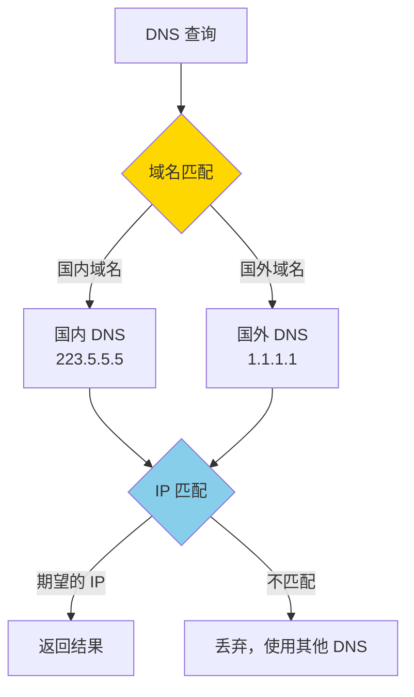

**DNS 策略**：
- **AsIs**：使用系统 DNS
- **UseIP**：优先使用 IP，减少 DNS 查询
- **IPIfNonMatch**：路由无法匹配域名时才解析 IP
- **IPOnDemand**：按需解析

### 5. 出站处理（Outbound）

出站负责连接目标服务器或下一跳代理。

**出站类型**：
- **代理协议**：VLESS、VMess、Trojan、Shadowsocks、Wireguard
- **Freedom**：直连（可指定出口 IP）
- **Blackhole**：黑洞（丢弃流量）
- **DNS**：DNS 查询代理
- **Loopback**：环回到入站

---

## 数据流处理

### 完整数据流

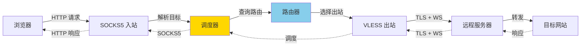

### 传输层封装

Xray 的协议层和传输层分离，可以灵活组合。

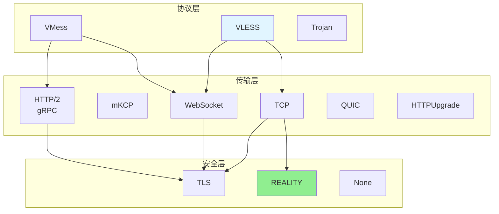

**组合示例**：
- VLESS + TCP + TLS
- VLESS + TCP + REALITY
- VLESS + WebSocket + TLS
- VLESS + gRPC + TLS
- VMess + WebSocket + TLS

---

## 配置结构

### JSON 配置文件结构

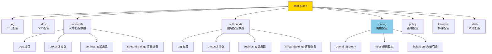

### 最小配置示例

**客户端**：
```json
{
  "inbounds": [{
    "port": 1080,
    "protocol": "socks"
  }],
  "outbounds": [{
    "protocol": "vless",
    "settings": {
      "vnext": [{
        "address": "server.com",
        "port": 443,
        "users": [{"id": "uuid"}]
      }]
    }
  }]
}
```

**服务端**：
```json
{
  "inbounds": [{
    "port": 443,
    "protocol": "vless",
    "settings": {
      "clients": [{"id": "uuid"}]
    }
  }],
  "outbounds": [{
    "protocol": "freedom"
  }]
}
```

---

## 高级特性

### 1. Fallback 机制

当无法识别流量时，回退到其他服务（如网站）。

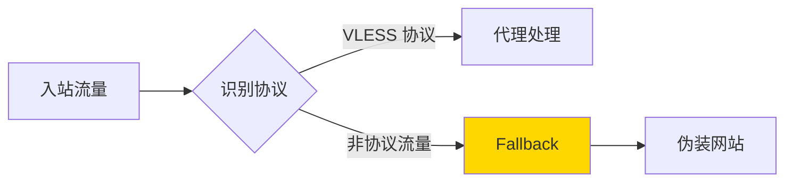

### 2. 链式代理

通过多个代理服务器转发流量。

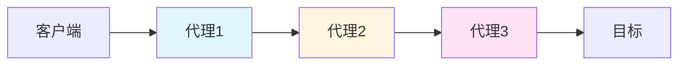

### 3. 负载均衡

分发流量到多个出站，提高可用性和性能。

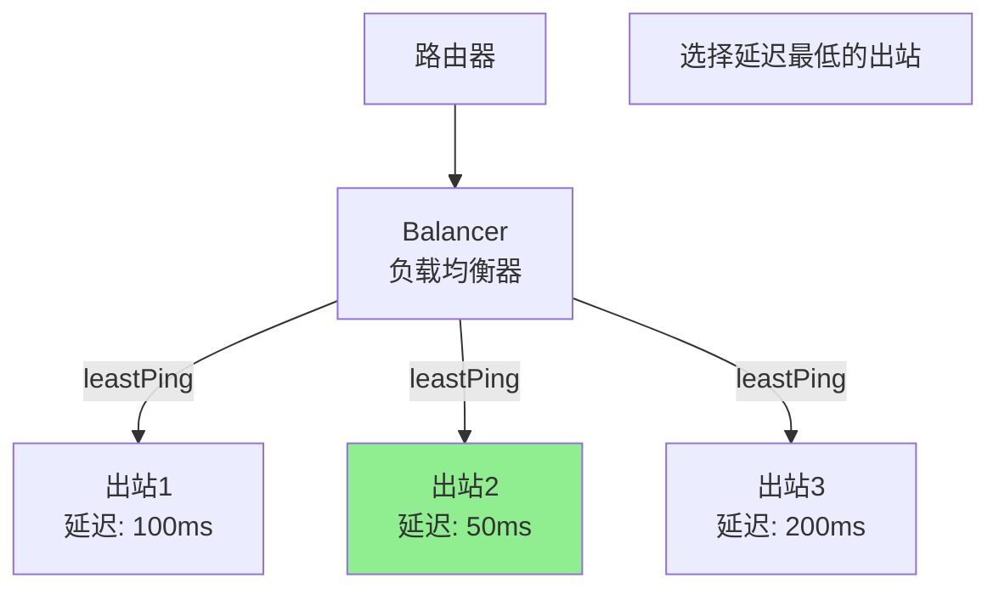

**负载均衡策略**：
- **random**：随机选择
- **leastPing**：选择延迟最低的（需要 Observatory）
- **leastLoad**：选择负载最低的

### 4. Observatory（观测器）

定期探测出站服务器的可用性和延迟。

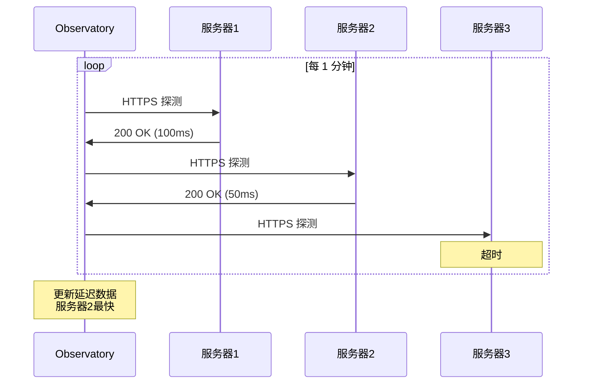

---

## 性能优化

### 1. 零拷贝（Zero Copy）

使用内存池和 buffer 复用减少内存分配。

### 2. 多路复用（Multiplexing）

单个连接承载多个数据流，减少握手开销。

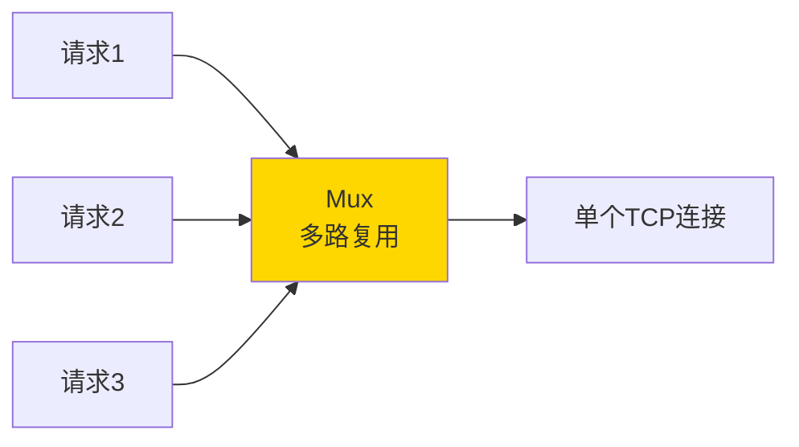

### 3. 连接复用

复用 TCP 连接，避免频繁建立连接。

---

## 安全特性

### 1. UUID 认证

每个用户使用唯一的 UUID 标识，防止未授权访问。

### 2. 时间验证

VMess 协议包含时间戳验证，防止重放攻击。

### 3. 流量混淆

通过 TLS、WebSocket 等传输层伪装流量特征。

### 4. 动态端口

可以配置动态修改端口，增加检测难度。

---

## 总结

### Xray 核心优势

| 特性 | 说明 |
|------|------|
| 🚀 高性能 | 零拷贝、连接复用、多路复用 |
| 🔒 安全性 | UUID 认证、时间验证、TLS 加密 |
| 🎭 伪装性 | REALITY、Fallback、多种传输层 |
| 🛣️ 灵活路由 | 强大的规则系统、负载均衡 |
| 🔧 可扩展 | 模块化设计、协议传输分离 |

### 架构对比

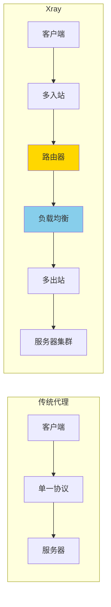

---

## 下一步

- 📖 了解 [协议对比](protocols-comparison.md)
- 🔒 深入 [REALITY 技术](reality-guide.md)
- ⚡ 学习 [XTLS Vision](xtls-vision-guide.md)
- 🛣️ 配置 [路由规则](routing-guide.md)
