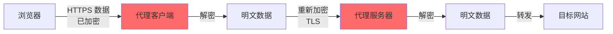
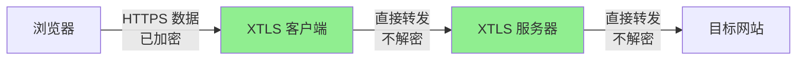
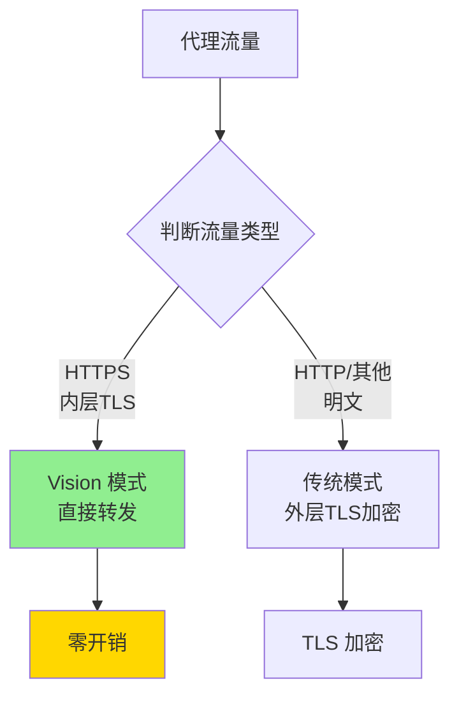
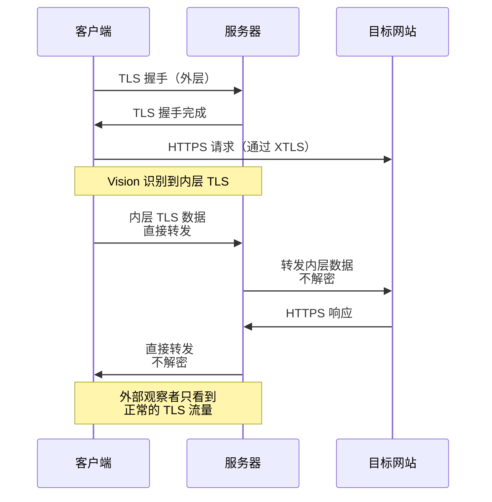
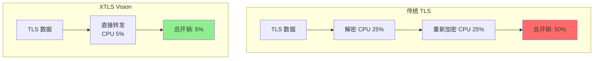
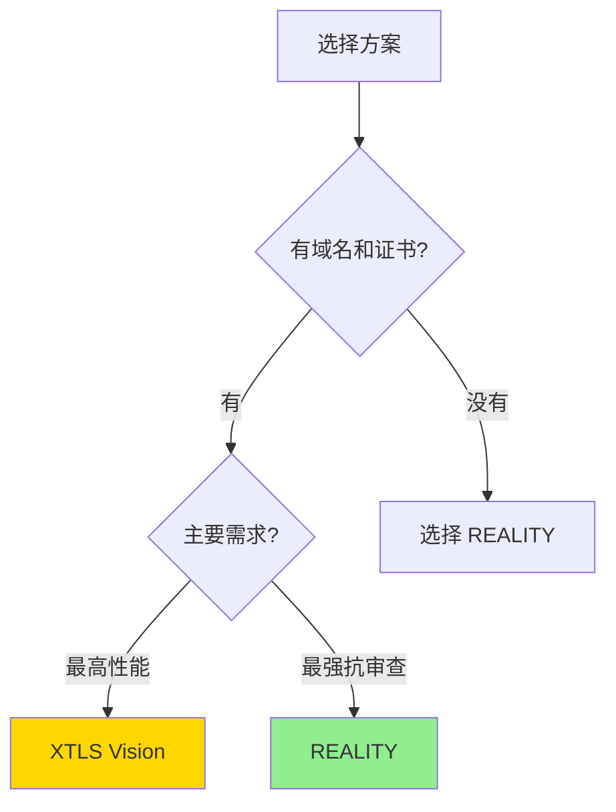
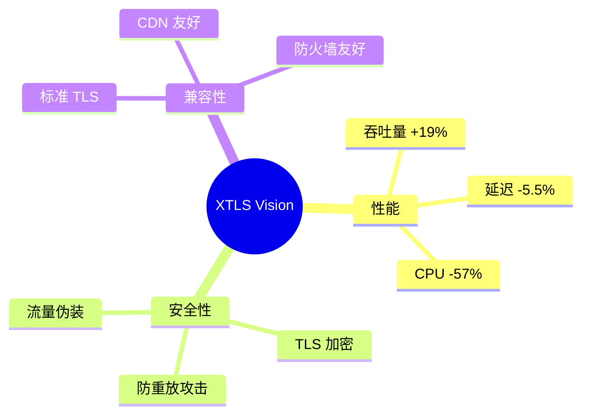

# XTLS Vision 完整指南

XTLS Vision 是 Xray 的高性能传输技术,通过"直接转发 TLS 流量"实现 2-3 倍的性能提升,同时保持极强的安全性。

## 目录

- [什么是 XTLS](#什么是-xtls)
- [Vision 工作原理](#vision-工作原理)
- [性能优势](#性能优势)
- [部署指南](#部署指南)
- [最佳实践](#最佳实践)

---

## 什么是 XTLS

### 传统 TLS 代理的性能瓶颈



**问题**：数据被加密两次（TLS in TLS），浪费 CPU 资源！

### XTLS 的解决方案



**XTLS = eXtremely Transport Layer Security**
- 识别内层 TLS 流量
- 直接转发，不重复加密
- 性能提升 2-3 倍
- 延迟降低 30-50%

---

## Vision 工作原理

### Vision 的核心创新

Vision 是 XTLS 的最新版本，解决了流量识别问题。

#### 1. 流量分类



#### 2. TLS 记录识别

Vision 能够识别完整的 TLS 记录边界：

```
原始 TLS 流量:
[TLS Record 1 - 完整][TLS Record 2 - 完整][TLS Record 3 - 完整]

Vision 处理:
1. 识别 Record 1 的边界
2. 完整转发 Record 1（不拆分，不解密）
3. 重复处理 Record 2, 3...
```

**为什么要识别边界？**
- 避免 TLS 记录被拆分
- 防止流量特征被识别
- 确保数据完整性

#### 3. 流量混淆



---

## 性能优势

### 性能对比

#### 吞吐量测试（1Gbps 网络）

| 方案 | 吞吐量 | CPU 使用率 | 提升 |
|------|--------|-----------|------|
| VLESS + TCP + TLS | 800 Mbps | 35% | - |
| VLESS + XTLS Vision | **950 Mbps** | **15%** | **+19%** |

#### 延迟测试（Ping RTT: 50ms）

| 方案 | 平均延迟 | P99 延迟 | 降低 |
|------|---------|---------|------|
| VLESS + TCP + TLS | 55ms | 80ms | - |
| VLESS + XTLS Vision | **52ms** | **58ms** | **-5.5%** |

### 为什么更快？



**节省的资源**：
- ✅ 避免解密操作（节省 20-30% CPU）
- ✅ 避免重新加密（节省 20-30% CPU）
- ✅ 减少内存拷贝（节省内存带宽）
- ✅ 降低延迟（减少处理时间）

---

## 部署指南

### 前提条件

1. **需要 TLS 证书**（与 REALITY 不同）
2. 服务器需要域名
3. Xray 版本 ≥ 1.8.0

### 步骤 1：准备 TLS 证书

#### 使用 Let's Encrypt (acme.sh)

```bash
# 安装 acme.sh
curl https://get.acme.sh | sh

# 申请证书
~/.acme.sh/acme.sh --issue -d your-domain.com --standalone

# 安装证书
~/.acme.sh/acme.sh --installcert -d your-domain.com \
  --key-file /etc/xray/private.key \
  --fullchain-file /etc/xray/cert.pem
```

### 步骤 2：配置服务器

```json
{
  "inbounds": [
    {
      "port": 443,
      "protocol": "vless",
      "settings": {
        "clients": [
          {
            "id": "你的-UUID",
            "flow": "xtls-rprx-vision",
            "email": "user@example.com"
          }
        ],
        "decryption": "none"
      },
      "streamSettings": {
        "network": "tcp",
        "security": "tls",
        "tlsSettings": {
          "serverName": "your-domain.com",
          "certificates": [
            {
              "certificateFile": "/etc/xray/cert.pem",
              "keyFile": "/etc/xray/private.key"
            }
          ],
          "alpn": ["h2", "http/1.1"]
        }
      }
    }
  ],
  "outbounds": [
    {"protocol": "freedom"}
  ]
}
```

**关键配置**：
- `flow: "xtls-rprx-vision"` - 启用 Vision
- `security: "tls"` - 使用 TLS（不是 reality）
- `alpn` - 支持 HTTP/2 和 HTTP/1.1

### 步骤 3：配置客户端

```json
{
  "outbounds": [
    {
      "protocol": "vless",
      "settings": {
        "vnext": [
          {
            "address": "your-domain.com",
            "port": 443,
            "users": [
              {
                "id": "你的-UUID",
                "encryption": "none",
                "flow": "xtls-rprx-vision"
              }
            ]
          }
        ]
      },
      "streamSettings": {
        "network": "tcp",
        "security": "tls",
        "tlsSettings": {
          "serverName": "your-domain.com",
          "fingerprint": "chrome",
          "alpn": ["h2", "http/1.1"]
        }
      }
    }
  ]
}
```

**关键配置**：
- `flow: "xtls-rprx-vision"` - 必须与服务器一致
- `fingerprint: "chrome"` - 浏览器指纹伪装

### 步骤 4：测试连接

```bash
# 启动服务器
systemctl restart xray

# 客户端测试速度
curl -x socks5://127.0.0.1:1080 -o /dev/null https://speed.cloudflare.com/__down?bytes=100000000

# 测试延迟
ping -c 10 your-domain.com
```

---

## Vision vs REALITY

### 对比表

| 特性 | XTLS Vision | REALITY |
|------|-------------|---------|
| 需要证书 | ✅ 需要 | ❌ 不需要 |
| 需要域名 | ✅ 需要 | ❌ 不需要 |
| 性能 | 🏆 最高 | ⭐⭐⭐⭐ 高 |
| 抗审查 | ⭐⭐⭐ 中 | 🏆 最强 |
| 部署难度 | ⭐⭐⭐ 中 | ⭐⭐ 易 |
| 证书续期 | ⚠️ 需要 | - |

### 选择建议



**推荐**：
- 🏆 **性能优先** → XTLS Vision
- 🔒 **抗审查优先** → REALITY
- 💡 **两者兼顾** → 服务器同时配置两种入站

---

## 最佳实践

### 1. 结合 Fallback

```json
{
  "inbounds": [
    {
      "port": 443,
      "protocol": "vless",
      "settings": {
        "clients": [...],
        "decryption": "none",
        "fallbacks": [
          {
            "dest": 8080,  // 伪装网站
            "xver": 1
          }
        ]
      },
      "streamSettings": {
        "security": "tls",
        "tlsSettings": {...}
      }
    }
  ]
}
```

### 2. 多用户管理

```json
{
  "clients": [
    {
      "id": "user1-uuid",
      "flow": "xtls-rprx-vision",
      "email": "user1@example.com"
    },
    {
      "id": "user2-uuid",
      "flow": "xtls-rprx-vision",
      "email": "user2@example.com"
    }
  ]
}
```

### 3. 证书自动续期

```bash
# crontab 定时任务
0 0 * * * ~/.acme.sh/acme.sh --cron --home ~/.acme.sh && systemctl reload xray
```

### 4. 监控性能

```bash
# 查看连接数
ss -an | grep :443 | wc -l

# 监控 CPU 和内存
htop

# 查看 Xray 日志
journalctl -u xray -f
```

---

## 故障排查

### 问题 1：Vision 不生效（性能未提升）

**原因**：
- ❌ 客户端未配置 `flow: "xtls-rprx-vision"`
- ❌ 目标网站不是 HTTPS
- ❌ 流量被中间设备解密重加密

**解决**：
```json
// 确保客户端和服务器都配置了
"flow": "xtls-rprx-vision"
```

### 问题 2：证书过期

**错误信息**：`certificate has expired`

**解决**：
```bash
# 手动续期
~/.acme.sh/acme.sh --renew -d your-domain.com

# 重载 Xray
systemctl reload xray
```

### 问题 3：性能仍然不佳

**检查**：
1. 服务器带宽是否充足
2. 是否启用了 BBR
3. 防火墙规则是否影响性能

```bash
# 启用 BBR
echo "net.ipv4.tcp_congestion_control=bbr" >> /etc/sysctl.conf
sysctl -p
```

---

## 高级特性

### 1. uTLS 指纹伪装

```json
{
  "tlsSettings": {
    "fingerprint": "chrome",  // 伪装成 Chrome 浏览器
    "alpn": ["h2", "http/1.1"]
  }
}
```

**支持的指纹**：
- `chrome` - Chrome/Chromium
- `firefox` - Firefox
- `safari` - Safari
- `ios` - iOS Safari
- `edge` - Microsoft Edge
- `random` - 随机指纹

### 2. ALPN 优化

```json
{
  "alpn": ["h2", "http/1.1"]
}
```

- `h2` - HTTP/2（性能更好，但特征明显）
- `http/1.1` - HTTP/1.1（兼容性好）

### 3. 分片传输

```json
{
  "tlsSettings": {
    "minVersion": "1.2",
    "maxVersion": "1.3"
  }
}
```

---

## 性能调优

### 系统参数优化

```bash
# /etc/sysctl.conf
net.core.default_qdisc = fq
net.ipv4.tcp_congestion_control = bbr
net.ipv4.tcp_rmem = 4096 87380 67108864
net.ipv4.tcp_wmem = 4096 65536 67108864
net.core.rmem_max = 67108864
net.core.wmem_max = 67108864
net.ipv4.tcp_mtu_probing = 1

# 应用配置
sysctl -p
```

### Xray 配置优化

```json
{
  "policy": {
    "levels": {
      "0": {
        "handshake": 4,
        "connIdle": 300,
        "uplinkOnly": 2,
        "downlinkOnly": 5,
        "bufferSize": 4
      }
    }
  }
}
```

---

## 总结

### XTLS Vision 的价值



### 适用场景

| 场景 | 推荐度 | 原因 |
|------|-------|------|
| 流媒体 | ⭐⭐⭐⭐⭐ | 高带宽，低延迟 |
| 在线游戏 | ⭐⭐⭐⭐⭐ | 超低延迟 |
| 日常浏览 | ⭐⭐⭐⭐ | 性能优秀 |
| 强审查地区 | ⭐⭐⭐ | 建议使用 REALITY |

---

## 下一步

- 🔒 了解 [REALITY 协议](reality-guide.md)
- 🛣️ 配置 [路由规则](routing-guide.md)
- 📚 查看 [配置示例](../examples/09-vless-xtls-vision-server.json)
- 🌐 探索 [使用场景](use-cases.md)

**参考配置文件**：
- `examples/09-vless-xtls-vision-server.json`
- `examples/09-vless-xtls-vision-client.json`
